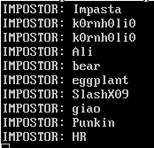

THE GREAT KORNHOLIO PRESENTS

# SusCheck
This script reveals impostors in Among Us. Simply leave the script running
while you join games, and the script will tell you who the impostor(s) are
when each game starts. The detection is completely passive, so you won't
be banned for using this, unless you tell people you're using it.

If you like this, you could buy me a beer ;)

BTC: `3G3NwDKrN5tbULaz61GSzZXTBEj9AY3fdL`

### Usage
This script is very easy to use:

1. Install scrapy: `python -m pip install scrapy`
2. Run the script: `python suscheck.py`
3. Join some games.

The script will then start sniffing packets and let you know when it smells
impostors. This is generally right when the game starts; if you start
the script in the middle of a game, it won't detect the impostor(s)
for that round.

Note that this is not perfect and it doesn't detect impostors 100%
of the time. It's more like 90-95%. Improvements could be made.

Feel free to report any issues.
